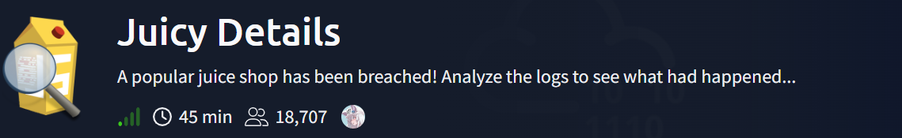

# Juicy Details

05/22/2026

Room Link: https://tryhackme.com/room/juicydetails



### **What tools did the attacker use? (Order by the occurrence in the log)**

**ANSWER: nmap, hydra, sqlmap, curl, feroxbuster**

We are starting to the what tools are used. This was on the TCM SOC 01 course specifically in the command line analysis. The only interest here is the agent string, meaning we need to retrieve the agent strings, but that will be so much info, so filtering is needed.

For this first one, I actually have a command from that course:

`cut -d '"' -f 6 access.log | sort | uniq -c | sort -nr`

This does prints out the agents (which it did on this challenge). However it should be “Order by occurrence”. So I had to tweak the code a little.

`cut -d '"' -f 6 access.log | awk '!seen[$0]++’` 

For this one, I used awk in order to printout from top-to-bottom = oldest-to-newest.


### What endpoint was vulnerable to a brute-force attack?

**ANSWER: /rest/user/login** 

By looking at the previous answers, there was a tool after the hydra which is sqlmap, that is used to find SQLi vulnerabilities. If that tool was used, then the attacker was really able to get it.

By narrowing down our focus on Hydra:

`grep “Hydra” access.log`


The /rest/user/login path was attacked by Hydra multiple times.

### What endpoint was vulnerable to SQL injection?

**ANSWER: /rest/products/search**

For this one, the challenge is basically finding the directory that is the attacker trying to inject sqli commands with, having the IP of the attacker in the previous command:

`grep "192.168.10.5" access.log | cut -d '"' -f 2 | sort | uniq -c`

As it did reveal the directories that are being poked, after scrolling up, the sqli attempts flooded, in just one path:


### What parameter was used for the SQL injection?

**ANSWER: q**

A vulnerable parameter, which is basically an open door where the attacker can do its attack.

```
GET /rest/products/search?q=1%3BSELECT%20PG_SLEEP%285%29-- HTTP/1.1
```

### What endpoint did the attacker try to use to retrieve files? (Include the /)

**ANSWER: /ftp**

This time, “retrieve” is to get. So GET

`grep “GET” access.log` 


`/ftp`  immediately caught my attention, since we are dealing with files, also “endpoint” word was mentioned.

### What section of the website did the attacker use to scrape user email addresses?

ANSWER: product reviews

Now, to answer this one, the attacker needs to look on the side where the user can generate responses (kind of like where they can output). Basically, comments, reviews, posts.

So I guessed maybe we are dealing with paths again, so I ran the same command from previous question. After scrolling up, I saw this one:


Multiple requests from the same person / attacker, who will make a multiple reviews like that, unless they are bot, definitely suspicious, I know that time I was making shallow guess but I gave it a try.

Since the question place holder asterisks has the same amount of characters as the word “product” and “review”. I gave it a try, and got it.

### Was their brute-force attack successful? If so, what is the timestamp of the successful login? (Yay/Nay, 11/Apr/2021:09:xx:xx +0000)

**ANSWER: Yay, 11/Apr/2021:09:16:31 +0000**

We are basically going back to the command from second question here but with a tweaks:

`grep “Hydra” access.log | grep “200”`

This time we pipe to another grep that searches 200 status code which is a success. In this this case, a successful login.


### What user information was the attacker able to retrieve from the endpoint vulnerable to SQL injection?

**ANSWER: email, password**

This might be just lucky guess but I did go back to the observation of paths


Looked at the SQLi attempts, an tried to look what are they trying to retrieve, in this case, the:

q=qwert%27))%20UNION%20SELECT%20id,%20email,%20password,%20%274%27,%20%275%27,%20%276%27,%20%277%27,%20%278%27,%20%279%27%20FROM%20Users

Which was very obvious that the attacker was trying to pull email and password  from users table.

### What files did they try to download from the vulnerable endpoint? (endpoint from the previous task, question #5)

**ANSWER: coupons_2013.md.bak, www-data.bak**

Since we were dealing with ftp:

`grep “ftp” access.log`


though another method that I was just realized when I was writing is basically peeking on the vsftpd.log using cat or strings:


### What service and account name were used to retrieve files from the previous question? (service, username)

**ANSWER: ftp, anonymous**

FTP, this was answered a while ago on a previous question. As for the second one, we can find it by peeking on vsftpd.log again.

So start by scrolling up and keep on tracking the users, so far there is no other username. Only an anonymous login was there, so that must be it.


### What service and username were used to gain shell access to the server? (service, username)

**ANSWER: ssh, www-data**

Since “shell” word was already mentioned, I had an idea that it is secure shell (ssh), and that was confirmed by auth.log where it contains basically ssh logs.

As for the username:

grep “user” access.log

The command did not do much much but it helps by highlighting the things where should I look  for.


