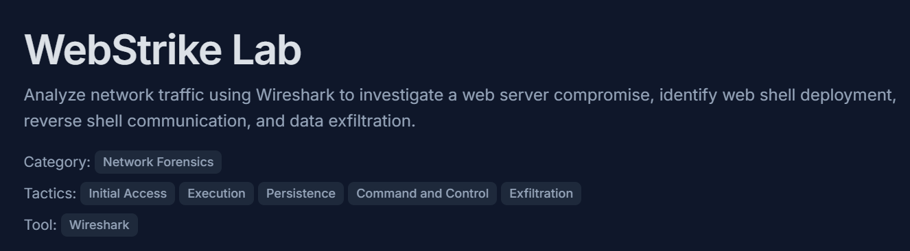
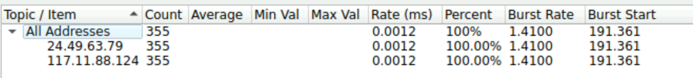
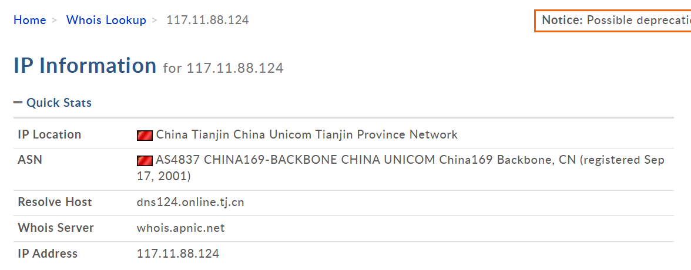
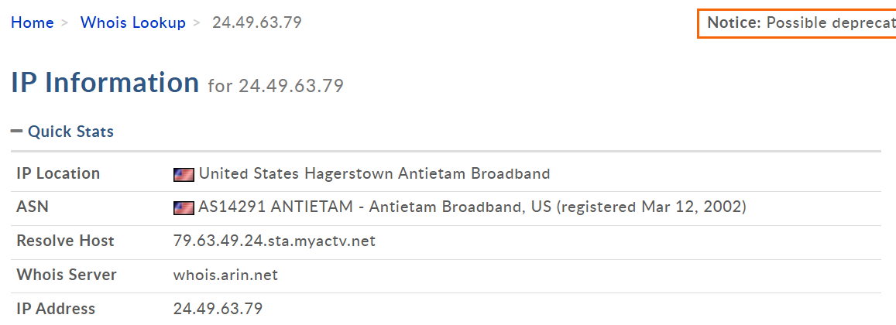
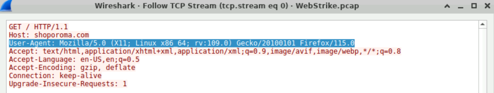
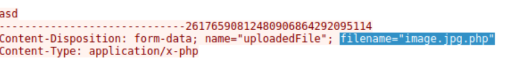
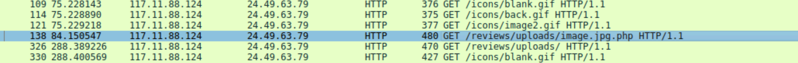
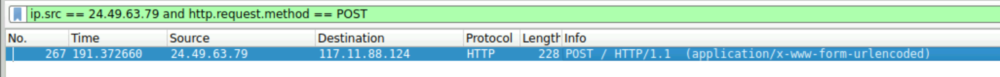
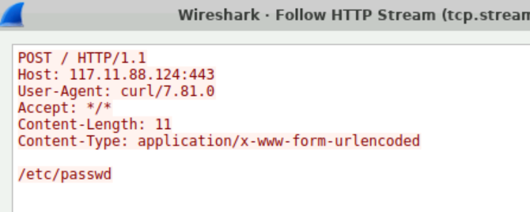

# WebStrike



Title: WebStrike

Link: [https://cyberdefenders.org/blueteam-ctf-challenges/webstrike/](https://cyberdefenders.org/blueteam-ctf-challenges/webstrike/)

Date: 05/24/26

## Analysis

#### Phase 1: Analyzing the Attacker Traffic

By identifying the two present IP address, I did it by going to the built-in statistics feature of Wireshark. After obtaining the IPv4 addresses, I checked it using Whois Domain Tools, and outputs two different countries. By further analyzing the logs, the way how two IPs communicate (like how the attacker continuously poked the directories of victim IP), it was clear the 117[.]11[.]88[.]124 (China) was the one who is harming the victim IP. Since, I got the attacker IP now, I followed the HTTP stream of the malicious traffic (the packet that trying to access some directories)to capture and isolate the attacker's unique User-Agent string. 

**IP Addresses:**



---

**Geolocations:**





---

**User-Agent strings:**



#### Phase 2: Investigating File Upload

Instead of going through the pockets one by one. I thought that the attacker must have upload the webshell, now, to upload POST request are done. So I filtered the logs with a command (will be showed at the end of this phase).

This outputs small number of packets (3) efficiently lowering down the number of must investigated packets. As for the directory, if uploading happens in POST then retrieving data for the user happens in GET, so if I can pinpoint where that GET requests are taking from, then there is a high chance I can find the directory. So i did the same process by filtering the GET methods only to lower down the packets that I will investigated. 

**Webshell used:**



**Vulnerable Path:**



---

**Command/s I used:**

```
http.request.method == POST
http.request.method == GET
```

#### **Phase 3: Tracking the Stolen Data**

Next, in determining the port that was used by the attacker to open a reverse shell was 8080. By obtaining this, I just simply observed the ports available, which is TCP and HTTP and reverse shells commonly use HTTP as a tunnel. I maybe made a guess here but I am considering reading other Writeups to know more about this situation. As for the file that the attacker was trying to exfiltrate was the passwd file. 

The get this, I thought, if it is a file then he must have tried to copy and download it, right? So, as I mentioned earlier, TCP port was present in the investigation. So if the attacker was able to get a reverse shell, then the communication of the IPs will be reverse, the victim IP will be now the source of packets if there is command done. After all, the system was infiltrated by the attacker already.

So I ran a command that filters the packets that contains the victims IP as a source and used POST as a method (when attempting to send the file).

**The result of command:**



**Compromised Data:**



---

#### **Command/s I used:**

```
ip.src == [victim_ip] and http.request.method == "POST"
```

## Indicators of Compromise (IOCs)

| **Indicator** | **Type** | **Description / Context** |
| --- | --- | --- |
| `117.11.88[.]124` | IPv4 | Attacker IP |
| `image.jpg[.]php` | File Name | Malicious PHP web shell payload |
| `/reviews/uploads/` | Directory Path | Compromised application path used for persistence |
| `8080` | Port | TCP port used for unauthorized outbound C2 communication |
| `/etc/passwd` | File Path | Target file exfiltrated by the threat actor |
