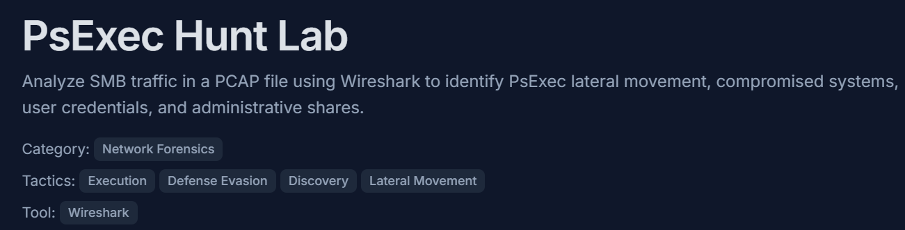

# PsExec Hunt Lab

Link: https://cyberdefenders.org/blueteam-ctf-challenges/psexec-hunt/

Date: 06/05/2026

Scenario: An alert from the Intrusion Detection System (IDS) flagged suspicious lateral movement activity involving PsExec. This indicates potential unauthorized access and movement across the network. As a SOC Analyst, your task is to investigate the provided PCAP file to trace the attacker’s activities. Identify their entry point, the machines targeted, the extent of the breach, and any critical indicators that reveal their tactics and objectives within the compromised environment.

## Analysis

**Q1: *To effectively trace the attacker's activities within our network, can you identify the IP address of the machine from which the attacker initially gained access?***

As with the other challenges I have tackled so far, my first move was to analyze the number of unique IPv4 addresses and the volume of connections each IP made. 

 Of course, I didn't rely solely on this metric, so I further investigated the suspected compromised IP address by going through the packet logs.

The logs clearly show that this IP address was accessing administrative resources and executing `PSEXESVC.exe`.

---

**Q2: *To fully understand the extent of the breach, can you determine the machine's hostname to which the attacker first pivoted?***

For this, I filtered packets that has source IP as `10[.]0[.]0[.]130`.  And followed TCP stream.

---

**Q3: Knowing the username of the account the attacker used for authentication will give us insights into the extent of the breach. What is the username utilized by the attacker for authentication?**

An SMB connection initiates with a standard TCP handshake, followed by protocol negotiation and the session authentication phase. As highlighted in the packet capture, inspecting the `Session Setup Request (NTLMSSP_AUTH)` in **Frame 132** explicitly reveals the compromised username used by the attacker: **`ssales`**.

---

**Q4: *After figuring out how the attacker moved within our network, we need to know what they did on the target machine. What's the name of the service executable the attacker set up on the target?***

---

**Q5: *We need to know how the attacker installed the service on the compromised machine to understand the attacker's lateral movement tactics. This can help identify other affected systems. Which network share was used by PsExec to install the service on the target machine***

Utilizing the compromised `ssales` account, the attacker successfully connected to the administrative share (`ADMIN$`) and issued an SMB2 `Create Request` to drop the `PSEXESVC.exe` binary onto the target filesystem.

---

**Q6: *We must identify the network share used to communicate between the two machines. Which network share did PsExec use for communication?***

This info came along on the part where the login request came with the username.

---

**Q7: *Now that we have a clearer picture of the attacker's activities on the compromised machine, it's important to identify any further lateral movement. What is the hostname of the second machine the attacker targeted to pivot within our network?***

The host at `10[.]0[.]0[.]131` is identified as a secondary target machine. The network logs capture this IP processing inbound requests and returning SMB2 responses, confirming it was executing remote commands and file writes initiated by the attacker.

---

## Indicators of Compromise

| **Indicator Type** | **Defanged Indicator** | **Context / Notes** |
| --- | --- | --- |
| **IPv4 Address** | `10[.]0[.]0[.]130` | Attacker / Pivot Source machine initiating the malicious SMB2 traffic. |
| **IPv4 Address** | `10[.]0[.]0[.]133` | Primary Target host (`HR-PC`) subjected to initial credential abuse. |
| **IPv4 Address** | `10[.]0[.]0[.]131` | Secondary Target host (`MARKETING-PC`) targeted during wider lateral movement. |
| **User Account** | `ssales` | Compromised account utilized by the attacker for NTLMSSP authentication. |
| **Network Share** | `\\[.]\\[.]10[.]0[.]0[.]133\IPC$` | Inter-Process Communication share targeted to establish named pipes. |
| **Network Share** | `\\[.]\\[.]10[.]0[.]0[.]133\ADMIN$` | Hidden administrative share targeted to drop the execution binary. |
| **File Name** | `PSEXESVC[.]exe` | Sysinternals PsExec service binary uploaded to the targets to grant remote code execution. |