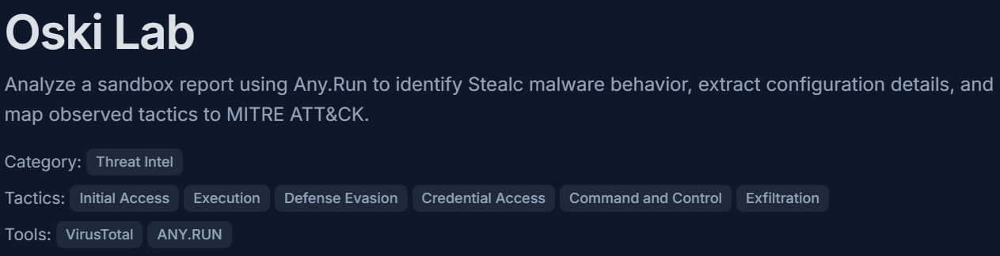
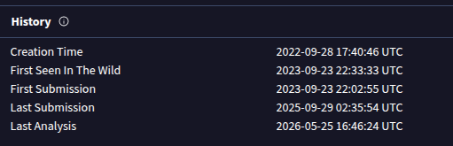
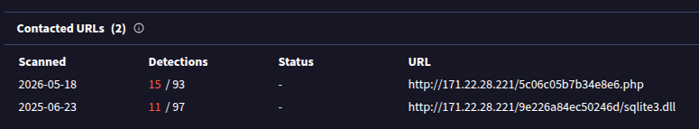
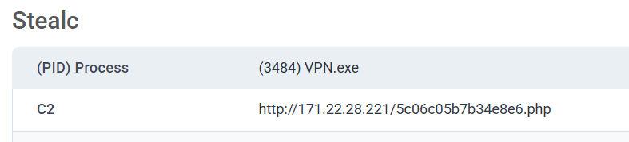
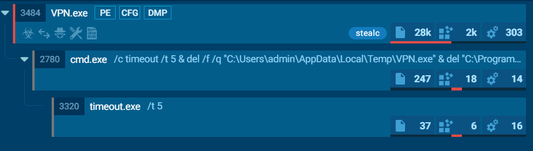
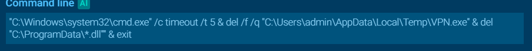

# Oski

Title: Oski

Link: https://cyberdefenders.org/blueteam-ctf-challenges/oski/

Date: 05/27/2026

## Analysis

### Phase 1: Malware Properties

The challenge provided a malware file hash to analyze. To determine the file's creation timestamp, I queried the hash on VirusTotal and located the exact time under the Details tab in the History section.

Because malware rarely acts in isolation and typically requires a server to download second-stage payloads or receive commands, I needed to identify its Command and Control (C2) infrastructure. As a beginner, I manually explored VirusTotal until I located the C2 server under the Relations tab beneath Contacted URLs. Looking back, I realized this information was readily available in the attached ANY.RUN sandbox report, a valuable lesson learned for future investigations.

**Creation Time:**

**C2 Infrastructure:**

### Phase 2: Malware Behavior and Stealing

During execution, the malware immediately targeted sensitive data on the host system. It loaded a specific dynamic link library, `sqlite3.dll`. Because modern web browsers store user credentials, cookies, and history inside local SQLite database files, the malware utilizes this DLL to programmatically query and extract the data before staging it for exfiltration.

Initially, identifying the exact MITRE ATT&CK technique was challenging, and I utilized a hint to point me toward **T1555,** specifically **T1555.003.**

However, looking closely at the execution UI, I discovered a much faster analysis workflow. By simply expanding the `VPN.exe` process node within the sandbox's process tree view, the platform directly maps and displays the triggered MITRE techniques right alongside the executing process. This eliminates the need to cross-reference external documentation manually.

**sqlite3.dll**

**AnyRun Strcuture**

**The technique discovered using the AnyRun UI**

### Phase 3: Track Elimination

To complicate forensic analysis and cover its tracks (**Defense Evasion**), the malware deleted the `.dll` files it dropped into the `C:\ProgramData` directory.

Furthermore, the sandbox process tree revealed a self-deletion mechanism. The malware spawned a command line prompt (`cmd.exe`) that executed a `timeout /t 5` command, introducing a 5-second delay to ensure the primary `VPN.exe` process stopped running before completely deleting itself from the system.

**Command Line used**

## Reflection

This challenge highlighted gaps in my foundational Threat Intelligence knowledge. I realized the importance of thoroughly reviewing automated sandbox reports rather than relying solely on manual open-source intelligence (OSINT) searches. Moving forward, I plan to research more threat intelligence frameworks and read community write-ups after completing labs to discover alternative analysis methodologies.

## Indicators of Compromise (IOCs)

| **IOC Type** | **Value / Path** | **Description** |
| --- | --- | --- |
| **MD5 Hash** | `12c1842c3ccafe7408c23ebf292ee3d9` | Primary malicious executable (`VPN.exe`) |
| **IPv4 Address** | `171[.]22[.]28[.]221` | Active Command & Control (C2) hosting server |
| **URL (C2)** | `http://171[.]22[.]28[.]221/5c06c05b7b34e8e6[.]php` | C2 communication gateway script |
| **URL (Payload)** | `http://171[.]22[.]28[.]221/9e226a84ec50246d/sqlite3[.]dll` | Path used to download the data-harvesting dependency |
| **File Path** | `C:\ProgramData\` | Staging directory used for dropped payloads and cleanup |
