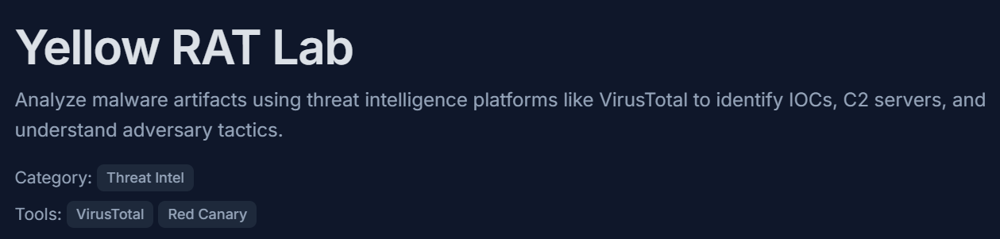
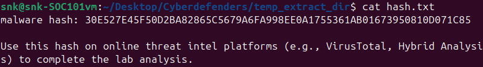

# Yellow RAT Lab

Title: Yellow RAT Lab

Link: https://cyberdefenders.org/blueteam-ctf-challenges/yellow-rat/

Date: 06/1/2026

## Analysis

### Threat Identification

---

***Understanding the adversary helps defend against attacks. What is the name of the malware family that causes abnormal network traffic?***

Using the challenge-provided hash, my first move was to pivot to VirusTotal for a quick assessment. The challenge title dropped a major hint that I was looking for a Remote Access Trojan (RAT), so my primary goal was to narrow down the specific variant.

While reviewing the *Detection* tab, a Crowdsourced YARA Rule for `Jupyter_Infostealer_DLL` caught my eye. Some quick OSINT research on this signature pointed me toward a [Red Canary Blog](https://redcanary.com/blog/threat-intelligence/yellow-cockatoo/), which explained that **Yellow Cockatoo** is simply an alias for the Jupyter Infostealer threat group.

**The Hash:**

**Yara Rule:**

---

**As for the next question:**

***As part of our incident response, knowing common filenames the malware uses can help scan other workstations for potential infection. What is the common filename associated with the malware discovered on our workstations?***

This already mentioned right from the start we searched the hash on the site.

Though we can go to Details Tab and Names Section to see more of its alt names.

---

***Determining the compilation timestamp of malware can reveal insights into its development and deployment timeline. What is the compilation timestamp of the malware that infected our network?***

This is under the Details Tab and History Section:

Also the same for the next question that was asking for the **when was the  malware first submitted to VirusTotal.**

---

***To completely eradicate the threat from Industries' systems, we need to identify all components dropped by the malware. What is the name of the .dat file that the malware dropped in the AppData folder?***

Going back the [Red Canary Blog](https://redcanary.com/blog/threat-intelligence/yellow-cockatoo/), we can scroll down to the bottom and the ‘**Deep dive on the .NET RAT**’ section, we can see more info:

---

***It is crucial to identify the C2 servers with which the malware communicates to block its communication and prevent further data exfiltration. What is the C2 server that the malware is communicating with?***

Also the same place as the previous question (this section has a lot of juicy info huh)

